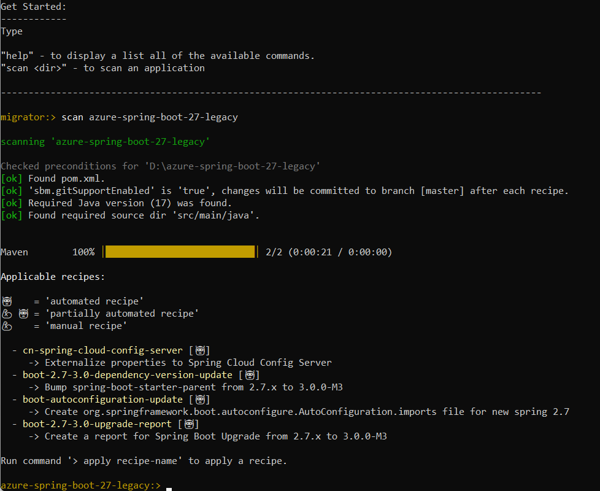
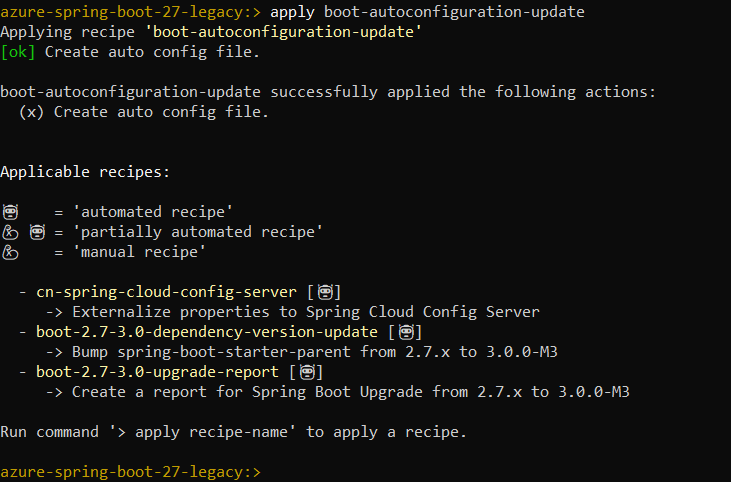
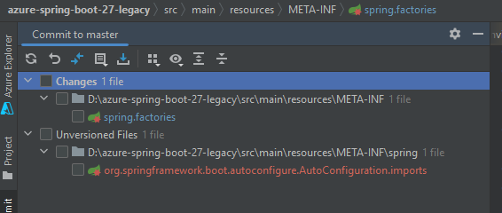
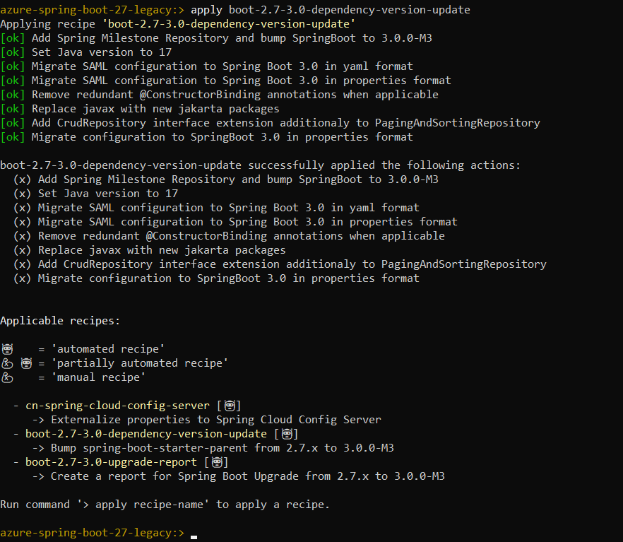
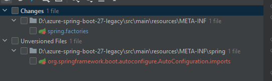

# Sample project for using Spring Cloud Azure Key Vault Secret and Stream Binder for Event Hubs

This project is targeted to demo the migration of a project, which is using Spring Cloud Azure libraries and Spring Boot 2.7 to Spring Boot 3.0.

## Prerequisites
- Java version 17
    - Spring Boot 3 requires Java 17
    - Spring Boot 2 supports Java8+
- [Terraform](https://www.terraform.io/)
- [An Azure subscription](https://azure.microsoft.com/free/)
- [Azure CLI](https://docs.microsoft.com/cli/azure/install-azure-cli)
- [Powershell](https://learn.microsoft.com/powershell/)
- Maven
- You can also import the code straight into your IDE:
    - [IntelliJ IDEA](https://www.jetbrains.com/idea/download)

## Provision Azure Resources

### Authenticate Using the Azure CLI
Terraform must authenticate to Azure to create infrastructure.

In your terminal, use the Azure CLI tool to setup your account permissions locally.

```shell
az login
```

Your browser window will open and you will be prompted to enter your Azure login credentials. After successful authentication, your terminal will display your subscription information. You do not need to save this output as it is saved in your system for Terraform to use.

```shell
You have logged in. Now let us find all the subscriptions to which you have access...

[
  {
    "cloudName": "AzureCloud",
    "homeTenantId": "home-Tenant-Id",
    "id": "subscription-id",
    "isDefault": true,
    "managedByTenants": [],
    "name": "Subscription-Name",
    "state": "Enabled",
    "tenantId": "0envbwi39-TenantId",
    "user": {
      "name": "your-username@domain.com",
      "type": "user"
    }
  }
]
```

If you have more than one subscription, specify the subscription-id you want to use with command below:
```shell
az account set --subscription <your-subscription-id>
```

### Provision the Resources
After login Azure CLI with your account, now you can use the terraform script to create Azure Resources.

#### Run with Bash

```shell
# In the root directory of the sample
# Initialize your Terraform configuration
terraform -chdir=./terraform init

# Apply your Terraform Configuration
terraform -chdir=./terraform apply -auto-approve

```

#### Run with Powershell

```shell
# In the root directory of the sample
# Initialize your Terraform configuration
terraform -chdir=terraform init

# Apply your Terraform Configuration
terraform -chdir=terraform apply -auto-approve

```

It may take a few minutes to run the script. After successful running, you will see prompt information like below:

```shell
...
azurecaf_name.azurecaf_name_eventhubs: Creating...
azurecaf_name.storage_account: Creating...
azurecaf_name.azurecaf_name_kv: Creating...

Apply complete! Resources: 18 added, 0 changed, 0 destroyed.

Outputs:

...

```

You can go to [Azure portal](https://ms.portal.azure.com/) in your web browser to check the resources you created.

### Export Output to Your Local Environment
Running the command below to export environment values:

#### Run with Bash

```shell
source ./terraform/setup_env.sh
```

#### Run with Powershell

```shell
terraform\setup_env.ps1
```

If you want to run the sample in debug mode, you can save the output value.

```shell
KEYVAULT_ENDPOINT=...
```

## Run and verify with Spring Boot 2

### Run the sample with Maven

In your terminal, run `mvn clean spring-boot:run`.

```shell
mvn clean spring-boot:run
```

### Verify This Sample

Start the application, then send a request to send a message to Event Hubs.

```shell
curl -X POST http://localhost:8080/message/send -H "Content-Type: application/json" -d "{\"content\":\"demo migration\"}"
```

Verify the below logs:

```text
Sending message: GenericMessage [payload=DemoEvent{id='1667872542592', content='demo'}, headers={id=52e066d8-fa00-fb04-6570-a38af8bc2595, timestamp=1667872542594}]
```

```text
Message 'DemoEvent{id='1667872542592', content='demo'}' successfully checked.
```

## Migrate to Spring Boot 3

Upgrade to Spring Boot 3.0.0 and Spring Cloud Azure 6.0.0, we expect some known changes can be done by the migration tool `spring-boot-migrator`, it will enhance the Spring Boot 3 support.

### Use tool spring-boot-migrator to upgrade

1. Update your environment variable `JAVA_HOME` to refer the Java 17.
2. Download the latest release from https://github.com/spring-projects-experimental/spring-boot-migrator/releases.
3. Make your project versioned by Git, which means committing all the changes before scanning the project.
4. Run the jar file with below command:
   `java -jar spring-boot-migrator.jar`
5. Acquire the recipes with below command:
   `scan azure-spring-boot-27-legacy`

   

   The applicable recipes will be listed in console, there will be the below 3 types:
    - automated recipe
    - partially automated recipe
    - manual recipe

6. Apply the recipe `boot-autoconfiguration-update` to use the new registration file for registering the auto configuration class.
   `apply boot-autoconfiguration-update`

   

   After applying the recipe, a log of `SBM: applied recipe 'boot-autoconfiguration-update'` was committed locally.

   Actually, the changes are not committed successfully.

   

7. Apply the recipe `boot-2.7-3.0-dependency-version-update` to upgrade dependencies.
   `apply boot-2.7-3.0-dependency-version-update`

   

   After applying the recipe, a log of `SBM: applied recipe 'boot-2.7-3.0-dependency-version-update'` was committed locally.

   Actually, partially changes are committed successfully, not all.

   

   Note: The recipe `boot-2.7-3.0-dependency-version-update` will include the recipe `boot-autoconfiguration-update` migration, so we can use this recipe directly.

8. Apply the recipe `boot-2.7-3.0-upgrade-report` to get the upgrade report.
   `apply boot-2.7-3.0-upgrade-report`

   The file *SPRING_BOOT_3_UPGRADE_REPORT.html* was generated in the project root path.

   After applying the recipe, a log of `SBM: applied recipe 'boot-2.7-3.0-upgrade-report'` was committed locally.

### Run and verify with Spring Boot 3

[Run and verify](#run-and-verify-with-spring-boot-2) again.

## Clean Up Resources
After running the sample, if you don't want to run the sample, remember to destroy the Azure resources you created to avoid unnecessary billing.

The terraform destroy command terminates resources managed by your Terraform project.   
To destroy the resources you created.

#### Run with Bash

```shell
terraform -chdir=./terraform destroy -auto-approve
```

#### Run with Powershell

```shell
terraform -chdir=terraform destroy -auto-approve
```
